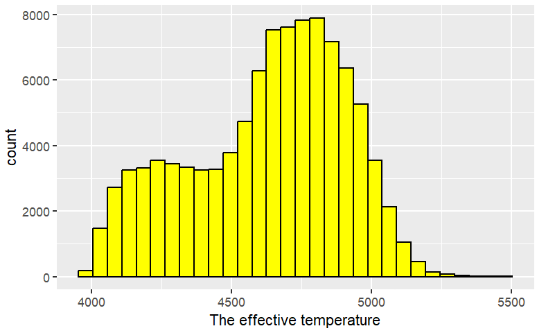
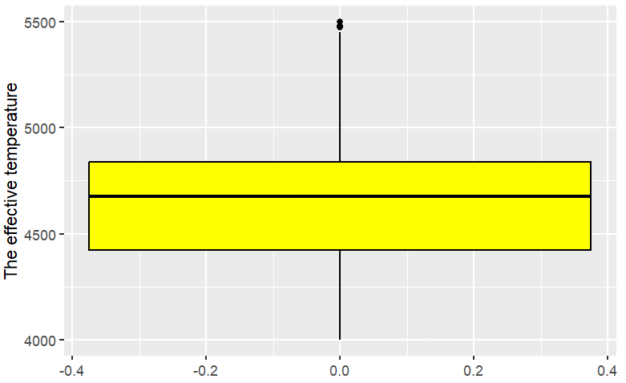
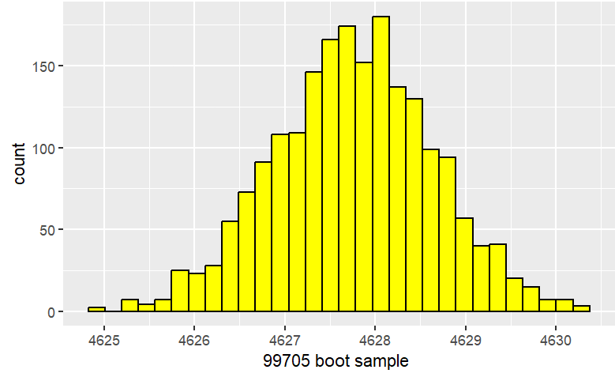
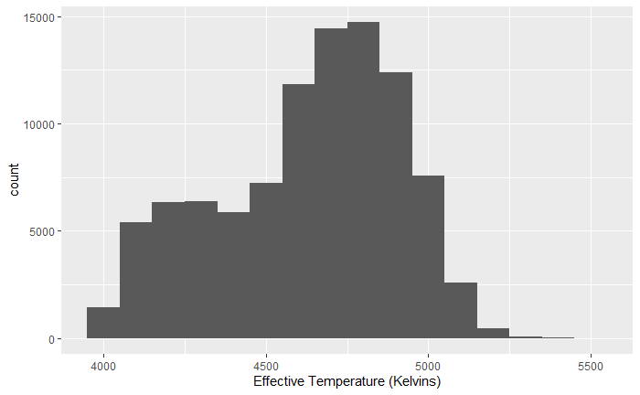
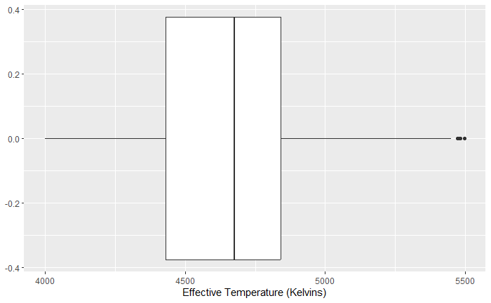
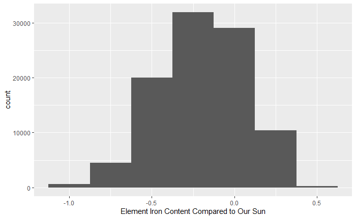
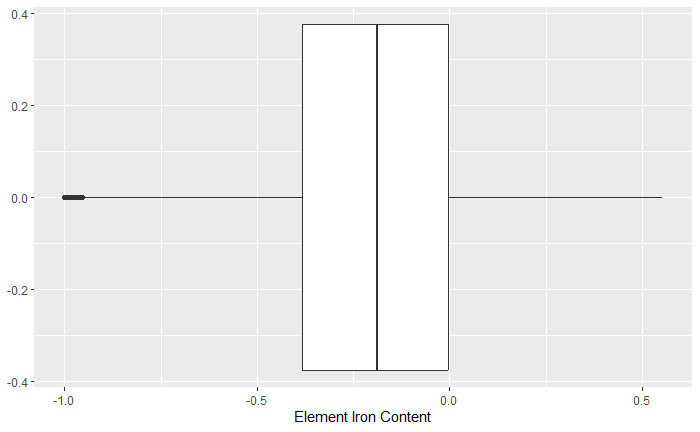
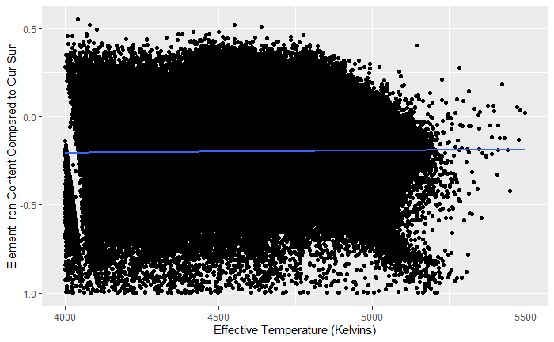
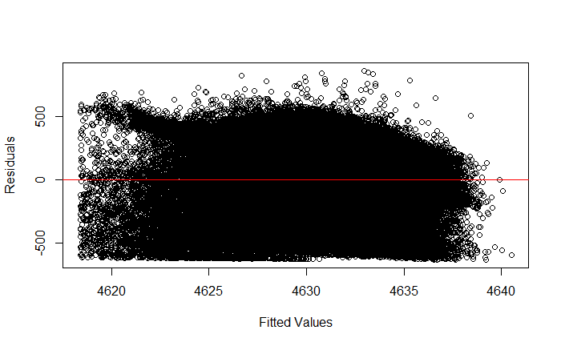
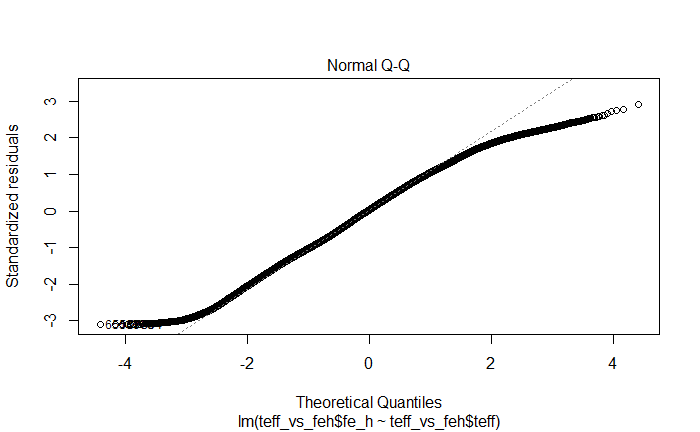

# Mean Effective Temperature Estimation via Confidence Intervals and Exploring the Relationship between Effective Temperature and Iron Abundance via A Linear Regression Analysis

**Authors:** 
Marshal Guo (1009468416)  
Kin Fung Ng (1009117849)

**Affiliation:** 
University of Toronto (St. George)

**Course:** 
STA130 Intro An Introduction to Statistical Reasoning and Data Science  
Instructor: Joshua Speagle

**Date:** 
April 8th, 2023

## Abstract
In Canada, secondary education has added the intro to astronomy to the curriculum. As beneficiaries of the school system, we learned that the red giant phase is the phase for some stars to go through during old age. Naturally, we want to learn some more facts about these interesting star bodies. The datasets provided by the SDSS APOGEE gave us resources to begin the investigation.

Surfing on the internet, we found that the average effective temperature of red giants might be between 3400 to 4500 (Davies, 2013). It requires a couple of steps to create a confidence interval. The first is to select related data and make it Tibble to do further analysis. Then We determine the mean temperature and sample size from the summary table that shows both the mean temperature and the number of observations in the teff data. With the pieces of information above, we can create a bootstrap method to estimate the sampling distribution of the data. Finally, we chose 95% of confidence to use for our interval. Therefore, we studied our sample and found out that, 95% of the time, the mean effective temperature we observed was between 4626.111 and 4628.694 kelvin. Which contradicts what we found online. This could be due to the sampling time since the finding we found was ten years ago, and such could be justified by the different technologies, quality and/or quantity of the data and so on.

Furthermore, we wanted to study if there is a general relationship between the effective temperature of these red giants and their iron abundance. Applying linear regression to the problem, we first peeked into the distribution of the iron content and effective temperature and noticed that the temperatures were uniformly distributed but the iron content contains lots of outliers below -1.0. Since we want to confirm if there exists a general relationship, we wanted to clean the data to only study the data above -1.0 in iron content (we chose -1.0 as a threshold because it doesn’t exclude all the outliers but enough to ignore the anomalies). We then applied the correlation and linear model functions and found that although the correlation coefficient implies there is a positive but weak relationship, the p-value is very small compared to the alpha which is 0.05. Thus we conclude there is a weak but positive relationship between the effective temperature and the iron content of the red giants.

## Question 1: Is the average temperature of a red giant between 3400-4500 kelvin?

### Motivation and Introduction
After a star is born, the star will age and become a red giant after a while. Since aging takes billions of years the elements that fuel the fusion process deplete. Fusion is the process of fusing lighter elements into heavier elements generating energy as a byproduct. With an interest in how hot the red giant is, we initiate the study. In this study, we will be using the data called "teff" which provides the effective temperature of stars in Kelvin to specifically look at the effective temperature of red giant stars. Also the statistical method we used in this study is confidence interval which is commonly used to estimate a population mean along with a percentage of confidence for the approximation.

### Familiarizing with the data
Given the SSDS APOGEE dataset, it contains 22 one-dimension datasets at our disposal, each containing observations of a single attribute in the sample of the red giants. In this case, we take only the "teff" data to analyze and we then have these 99705 observations.
The "teff" dataset contains observations on the effective temperature of each red giant of the sample, which is associated with the black body radiation of a star and is often used as a measurement of the surface temperature of star bodies (Kangro, 1976).

### Visualizing the Distribution of the attribute
First, let's take a look at the distribution of the effective temperature of the red giants. The range of different effective temperatures found in the sample is on the x-axis, and the y-axis shows the count of each bin width (which is 100 kelvin).

From the boxplot, we can tell that the median temperature is around 4650 kelvin and there are a few outliers at around 55000 kelvin. The box plot is useful to visualize the distribution of the temperature, the median, quantiles, and any outliers.
From the histogram, the x-axis represents the effective temperature and the y-axis represents the count of observations in each bin. This will allow us to see the shape of the temperature distribution. We can see that the effective temperature is mostly distributed between 4600 to 4750 kelvin. Hence the effective temperature is not normally distributed and also it seems not to match our research question’s data on temperature.

### Applying the bootstrap sampling distribution
To start, we created a Tibble and used it to initialize a bootstrap sampling distribution to estimate the mean temperature of the red giants. This involved randomly repeatedly sampling the original dataset 2000 times with replacement and the calculation of the mean temperature for each sample. Next, we store the results of the bootstrap sampling distribution. Then, The resulting sampling distribution of mean temperatures is used to calculate a confidence interval which provides a range of mean temperature between 4626.324 and 4629.228 kelvin within which the true mean temperature of the red giants will lie, with a 95% of confidence.

### Result
According to our analysis. We can say with 95% confidence that the true mean temperature of red giants lies between 4626.111 and 4628.694 kelvin. However, this observed result does not support the data we found on the internet that the average temperature of the red giant is between 3400-4500 kelvin. Therefore, we can conclude that the evidence suggests the average temperature of red giants does not match the initial information found on the internet.

### Discussion
The confidence interval that we calculated from the bootstrap sampling distribution of the mean temperature is statistically significant. The confidence interval provides us with a statistically significant range of values within which the true mean temperature of red giant stars lies, with a 95% level of confidence. Hence, the range of values we got from the bootstrap sampling distribution of the mean temperature provides compelling evidence that the actual mean temperature of the red giant stars lies within the confidence interval was found to be between 4636.111 and 4628.694 kelvin but not between 3400-4500 kelvin from our research question.
Furthermore, our results suggest that the underlying data may not follow a normal distribution. This is evident by both data visualization (histogram and boxplot) that we created. This reveals that the distribution of the effective temperatures of red giants is relatively left-skewed which also suggests that the sample mean in this case might not be the optimal estimate of the true population mean since it could be influenced by the outliers in the teff data.
From the methods used in this study, we can learn a few important features of statistical analysis. First, by repeating samples from the teff data, it creates a distribution of estimates which can create a sampling distribution visualization, calculate confidence intervals, and also evaluate the uncertainty of the estimates of mean temperature, the bootstrapping method is useful for estimating the population parameters. Secondly, the confidence interval is also an important tool in statistics because it provides a range of values that the true population parameters lie within a certain level of confidence, in this case, our level of confidence is set to be 95%. Also, the use of histograms and boxplots is useful in statistics. For example, it helps us to visualize the median, outliers, and skewness as well as the clear distribution of the specific data. These tools can provide us with clear features of the data and help us to make decisions on the choice of statistical methods.

## Question 2: Is there a general relationship between the temperature of the red giants and the iron contents for the group of red giants that display Fe_H values more than -1.0?

### Motivation and Introduction
As stars undergo fusion to generate energy, lighter elements like hydrogen and helium atoms crash into each other and form heavier elements. As the elements fuse and create energy, there becomes a point where the lighter elements that fuel the process run out. Little by little, the temperature which is the output energy will be decreasing and approach depletion while heavier elements are being made constantly. Thus we were motivated to see if there is a general relationship between the temperature and the amount of heavier elements such as iron present in the stars' atmosphere. To start the investigation, we are convinced that applying the simple linear regression technique will be most fitting. Thus, we first establish our null hypothesis as "There is no relationship between the effective temperature and iron abundance for red giants with Fe_H above -1.0." Alternatively, our alternative hypothesis is "There is a relationship between the effective temperature and iron abundance for red giants with Fe_H above -1.0."

### Familiarizing with the Data
Given the SSDS APOGEE dataset, there are twenty-two one-dimensional datasets at our disposal, each containing observations of a single attribute in the sample of the red giants. We extract only `teff` and `fe_h` to analyze, and we have these 99,705 corresponding observations.
The `teff` dataset contains observations on the effective temperature of each red giant of the sample, which is associated with the black body radiation of a star and is often used as a measurement of the surface temperature of star bodies (Kangro, 1976). As for the `fe_h` dataset, it contains observations on the Fe_H value, of each star body of the sample, which is a measurement of the abundance of elements heavier than helium in its atmosphere and defined as the logarithm of the ratio of iron to hydrogen abundance relative to the same ratio in the Sun (Haywood, 2020).

### Visualizing the Distribution of the Two Attributes 
First, let's take a look at the distribution of effective temperature of the red giants. The wide range of different effective temperatures found in the sample is on the x-axis, and the y-axis shows the count for each bin width (which is 100 kelvin).

From the boxplot, we can tell that the median temperature is around 4650 kelvin and there are a few outliers at around 55000 kelvin. The box plot is useful to visualize the distribution of the temperature, the median, quantiles, and any outliers.
From the histogram, the x-axis represents the effective temperature and the y-axis represents the count of observations in each bin. This will allow us to see the shape of the temperature distribution. We can see that the effective temperature is mostly distributed between 4600 to 4750 kelvin. Hence the effective temperature is not normally distributed and also it seems not to match our research question’s data on temperature.

Next, we look at the distribution of the iron abundance of these stars. The iron abundance goes on the x-axis, and the y-axis shows the count of each bin-width which is 0.25. From the histogram, we get that it's left-skewed, which is verified by the summary table that the mean (roughly -0.232) is less than the median (roughly -0.199). The spread of the data is around 2.88. 50% of the data lies between -0.403 to -0.001 approximately. From our boxplot, we observe a few outliers below -1. Similar to the effective temperature, the iron content sample we possess from the sample isn't completely normally distributed either.

### Visualizing the Relationship Between the Two Attributes
Putting it all together in a scatter plot, we get the effective temperature going on the x-axis and the iron abundance on the y-axis. Up front, we can see that the majority of the data clusters roughly between -0.8 to 0.3 or 0.4 for the y-axis, and the rest of the data are everywhere with a few outliers at the top and bottom of the pattern. As we can see from the best-fitted line, there is a positive linear relationship, and the linear model summary table can verify there is a positive but somewhat flatter slope. Due to the majority of data being evenly arranged above and below the best-fitted line, the linearity assumption of the linear regression technique is checked.

### Applying the Linear Regression
To start off, we calculated the correlation coefficient and got 0.013. Such implies there is a positive but weak relationship between the two variables. However, we won't be bogged down by such and continue to observe statistics on the linear regression model.
Next, we used the linear function in R to help us calculate the actual linear model and other crucial statistics. As a result, we got beta-0 and beta-1 estimates and found the linear equation of the best-fitted line in the above scatter plot as follows where x is the effective temperature, and y is the iron content.

y = -4.952 * 10^(-7) * x + 0.0135

Interestingly, we observe the p-value (which turns out to be 3.517e-05) is indeed smaller than our alpha, then we reject the null hypothesis and accept that there is a relationship between the two variables. However, the R-squared coefficient is nearly 0, which informs us that we need to check if the assumptions for linear regression are fully satisfied.
To begin with, we check if the data are evenly distributed above and below the best-fitted line. From the residual graph, we can see, for our sample, the data points are quite evenly distributed above and below the best-fitted line. Thus the residual assumption is not violated.

Secondly, we check if the residuals are normally distributed, we plot a Normal Q-Q graph and noticed that the two tails of the patterns slightly deviate from the line, which means not all residuals are normally distributed. As a result, the residual normality distribution is slightly violated.

### Results
Given our p-value is 3.517e-05 which is much less than our alpha being 0.05 and the assumptions for the linear regression technique are mostly satisfied, we successfully reject our null hypothesis and accept the alternative which is there is a relationship between the surface temperature and iron abundance of the red giants which Fe_H values are above -1.0. In the end, we conclude that there appears to be a weak positive relationship between the effective temperature and the iron content of the red giants. However, we acknowledge that skepticism should be drawn to the fact that we didn’t have normally distributed data on teff and fe_h, which is the reason why the residual normality assumption is somewhat violated depending on subjective judgments.

### Discussion
Echoing the conclusions, we could now use effective temperature as an indicator for comparing red giants in the iron abundance in their atmosphere. Although the relationship is extremely weak, the p-value indicates that there is enough statistical significance. This may be due to that the iron content may not be the only indicator of the surface temperature. Further experiments can be done with multi-linear regression to test not only iron content but also other elements such as carbon, magnesium, and so on to get a whole picture. Another factor could be that we are limited by the number of observations and data; if we were given more data, we may be given some distributions that are more normal, which could help us in precision and, in turn, produce a more accurate outcome. A takeaway from this research question is that it's helpful to notice always check if the assumptions are fully met, so that we know we can produce reliable results.

### Conclusion
From our studies, we analyzed facts that interested us the most about red giants using datasets given by the SDSS APOGEE for our two research questions. For finding the average temperature of the star bodies, we applied bootstrapping and confidence intervals to analyze the mean of the random sample means; in the end, the mean lies, from our capture, between 4626 K and 4629 K. The analysis of question one highlights the importance of using the right statistical method for different research to have valid conclusions about the population parameters. In this case, the use of bootstrapping allows more strong estimates of true mean temperature and can be useful when the underlying distribution of data is unknown. While the confidence interval provides a range of values for the true mean temperature that can help us to draw reliable conclusions based on the level of confidence we chose. The study of question one contributes to our knowledge of red giants and also shows the importance of statistical methods in astronomy research.
Furthermore, looking for the relationship between the surface temperature and the amount of iron present in the red giants' atmosphere for the group of red giants with Fe_H below -1.0. During this, we applied linear regression after checking for the assumptions. In conclusion, there seems to be a positive but weak interconnection between the two variables. Such phenomena may be due to that we didn’t have truly normally distributed data on both the effective temperature and iron content. Another explanation could be that iron content may not be the only indicator for temperature, and other elements could also contribute to the relationship, thus a multi-linear regression might hold a more mature conclusion.

### Appendix
For the second question, we altered the original question from the progress report by adding the extra condition that we are only interested in the group of red giants with their Fe_H value of more than -1.0. The justification for this change is that the distribution of the iron content has a lot of outliers around -1.0. Meanwhile, the purpose of the research question is to investigate if there is a general relationship that’s applicable for the majority of cases, so we decide to ignore the particular scenarios and cleaned our data to only include the red giants that have higher Fe_H values more than -1.0.
The coding of the project is all provided in the Rmd file.

### References
1. Davies, B., Kudritzki, R., Plez, B., Trager, S., Lançon, A., Gazak, Z., & . . . Chiavassa, A. (2013, March 18). IOPscience. Retrieved April 7, 2023, from <https://iopscience.iop.org/article/10.1088/0004-637X/767/1/3>
2. Kangro, H. (1976). The early history of Planck's Radiation Law. London: Taylor and Francis.
3. Haywood, M., Soubiran, O., & Lebzelter, T. (2020). The metallicity distribution of the Milky Way disk and bulge. Annual Review of Astronomy and Astrophysics, 58(1), 207-259. <https://doi.org/10.1146/annurev-astro-032620-021927>

Note: formal docs report is availble in the repo.